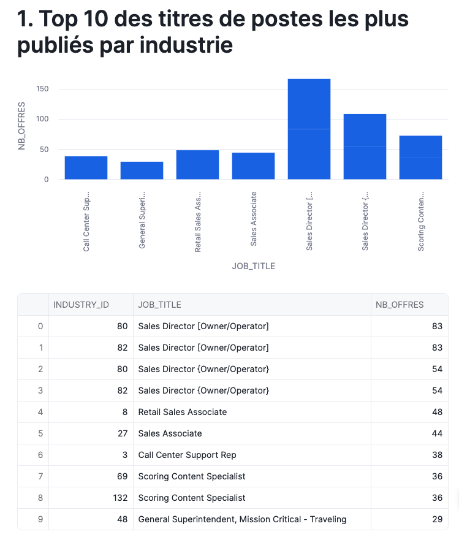
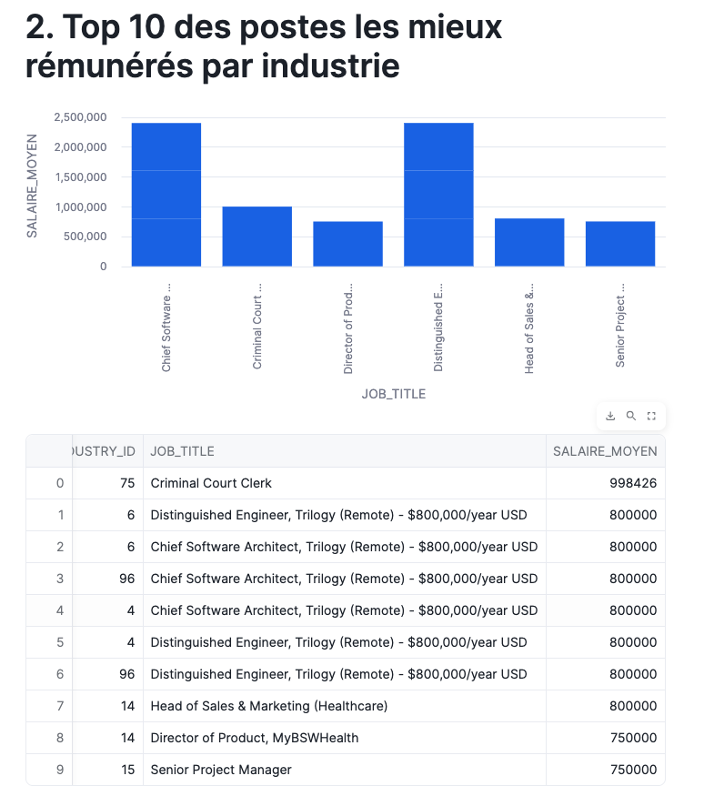
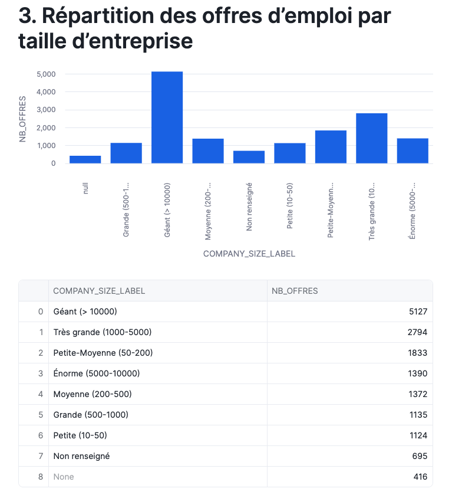
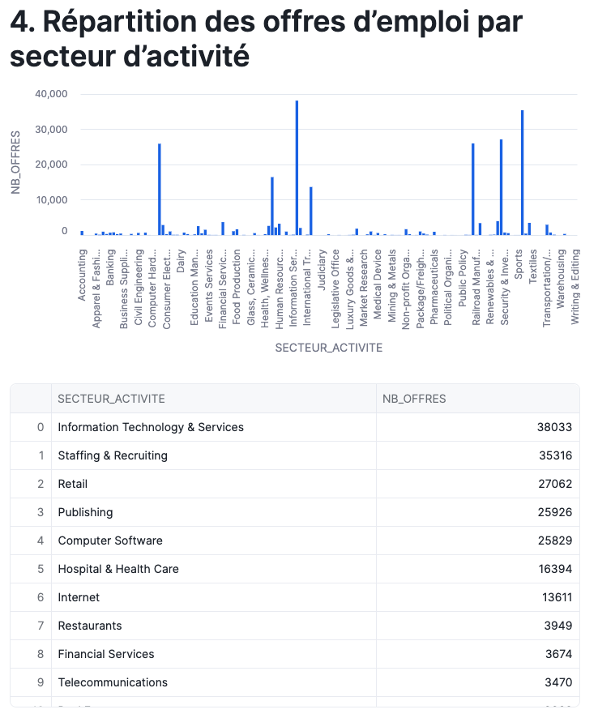
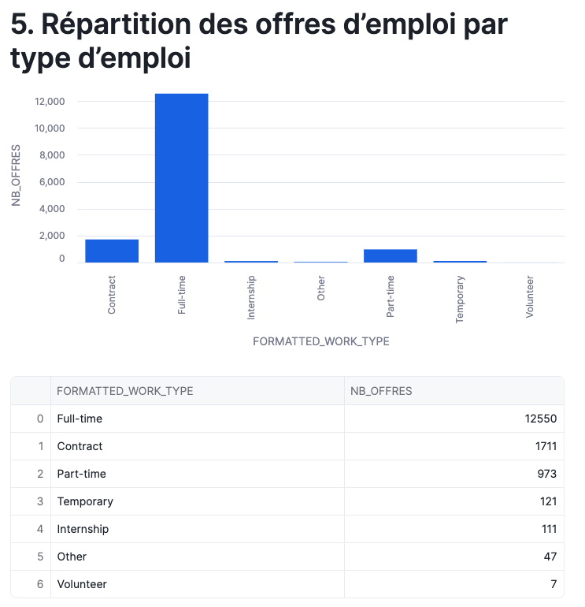

# Analyse des Offres d'Emploi LinkedIn avec Snowflake

**Projet d'évaluation — Architecture Big Data**  
**Groupe :** Manuella & Pierre  
**Référence :** MBAESG_EVALUATION_ARCHITECTURE_BIGDATA  
**Annexes :** Streamlit_app.py et LinkedinProject.sql


---

## Table des matières

1. [Introduction et Objectif](#1-introduction-et-objectif)
2. [Description du Dataset](#2-description-du-dataset)
3. [Architecture Medallion](#3-architecture-medallion)
4. [Modélisation Gold — Facts & Dimensions](#4-modélisation-gold--facts--dimensions)
5. [Analyses Réalisées](#5-analyses-réalisées)
6. [Visualisations Streamlit](#6-visualisations-streamlit)
7. [Problèmes Rencontrés et Solutions](#7-problèmes-rencontrés-et-solutions)
8. [Répartition des Tâches](#8-répartition-des-tâches)
9. [Conclusion](#9-conclusion)

---

## 1. Introduction et Objectif

 Ce projet a été réalisé dans le cadre d’un cours d’architecture Big Data et vise à mettre en pratique notre capacité à manipuler des données volumineuses à l'aide de Snowflake, en appliquant l'architecture Medallion (Bronze / Silver / Gold) sur un jeu de données réel provenant de LinkedIn comme nous l'avons vu dans les TPs en cours.

Le dataset utilisé contient plusieurs milliers d'offres d'emploi publiées sur LinkedIn. À partir de ces données, nous avons construit un pipeline de données complet, depuis le chargement brut des fichiers jusqu'aux visualisations analytiques réalisées avec Streamlit directement dans Snowflake.

L'ensemble du projet a été réalisé exclusivement via des scripts SQL et Python, sans utilisation d'interface graphique, conformément aux exigences du TP.

---

## 2. Description du Dataset

Les données sont disponibles dans le bucket S3 public : **s3://snowflake-lab-bucket/**

### Fichiers CSV

| Fichier | Description |
|--------|-------------|
| `job_postings.csv` | Offres d'emploi : titre, salaire, type de contrat, localisation... |
| `benefits.csv` | Avantages associés à chaque offre (mutuelle, 401K, etc.) |
| `employee_counts.csv` | Nombre d'employés et de followers par entreprise |
| `job_skills.csv` | Compétences associées à chaque offre d'emploi |

### Fichiers JSON

| Fichier | Description |
|--------|-------------|
| `companies.json` | Informations détaillées sur chaque entreprise (nom, taille, localisation...) |
| `company_industries.json` | Secteurs d'activité associés à chaque entreprise |
| `company_specialities.json` | Spécialités associées à chaque entreprise |
| `job_industries.json` | Secteurs d'activité associés à chaque offre d'emploi |

---

## 3. Architecture Medallion

Nous avons appliqué l'architecture Medallion, une approche standard en ingénierie des données qui organise les données en trois couches progressives, chacune avec un niveau de qualité et de transformation croissant.

### 3.1 Couche BRONZE — Données brutes

La couche Bronze correspond au chargement brut des fichiers depuis le bucket S3, sans aucune transformation. Toutes les colonnes sont stockées en type `STRING` pour éviter les erreurs de chargement.

Étapes réalisées :
- Création de la base de données `LINKEDIN` et du schéma `BRONZE`
- Création d'un stage externe pointant vers `s3://snowflake-lab-bucket/`
- Définition des formats de fichiers CSV et JSON
- Création des 8 tables Bronze avec `COPY INTO`

```sql
CREATE DATABASE IF NOT EXISTS LINKEDIN;
CREATE SCHEMA IF NOT EXISTS LINKEDIN.BRONZE;

CREATE OR REPLACE STAGE LINKEDIN.BRONZE.linkedin_stage
  URL = 's3://snowflake-lab-bucket/';

CREATE OR REPLACE FILE FORMAT LINKEDIN.BRONZE.csv_format
  TYPE = 'CSV'
  SKIP_HEADER = 1
  FIELD_OPTIONALLY_ENCLOSED_BY = '"';

CREATE OR REPLACE FILE FORMAT LINKEDIN.BRONZE.json_format
  TYPE = 'JSON'
  STRIP_OUTER_ARRAY = TRUE;
```

### 3.2 Couche SILVER — Données nettoyées

La couche Silver est la couche de transformation. On y nettoie les données, on caste les types correctement (dates, entiers, booléens, flottants), et on extrait les champs des colonnes JSON (type VARIANT) vers des colonnes distinctes.

Règles de nettoyage appliquées :
- Suppression des lignes sans `job_id`, sans titre ou sans `company_name`
- Exclusion des salaires négatifs ou égaux à zéro
- Conversion des timestamps UNIX en dates lisibles avec `TO_TIMESTAMP`
- Extraction des champs JSON avec la notation `data:champ::TYPE`
- Conversion du champ `remote_allowed` (0/1 en texte) vers `BOOLEAN`

> **Note :** La couche Silver ne contient volontairement pas de filtres métier (localisation, industries, niveaux de salaires) afin de conserver une base de données générique, réutilisable pour différents cas d'usage analytiques.

```sql
CREATE OR REPLACE TABLE LINKEDIN.SILVER.JOB_POSTINGS AS
SELECT
  job_id,
  company_name,
  title,
  max_salary::FLOAT AS max_salary,
  med_salary::FLOAT AS med_salary,
  min_salary::FLOAT AS min_salary,
  pay_period,
  formatted_work_type,
  location,
  applies::INT AS applies,
  TO_TIMESTAMP(original_listed_time::BIGINT / 1000) AS original_listed_time,
  CASE
    WHEN remote_allowed = '1' THEN TRUE
    WHEN remote_allowed = '0' THEN FALSE
    ELSE NULL
  END AS remote_allowed,
  views::INT AS views,
  formatted_experience_level,
  sponsored::BOOLEAN AS sponsored,
  work_type,
  currency,
  compensation_type
FROM LINKEDIN.BRONZE.JOB_POSTINGS
WHERE job_id IS NOT NULL
  AND title IS NOT NULL
  AND company_name IS NOT NULL
  AND TRIM(title) <> ''
  AND (min_salary IS NULL OR min_salary > 0)
  AND (max_salary IS NULL OR max_salary > 0);
```

### 3.3 Couche GOLD — Données analytiques

La couche Gold est la couche finale, prête pour l'analyse. Elle contient des vues dimensionnelles et des tables de faits suivant le modèle en étoile. C'est à partir de cette couche que toutes les analyses Streamlit ont été réalisées.

Les analyses ont été réalisées à partir des tables de faits et de dimensions de la couche Gold, garantissant une séparation claire entre données métiers et données analytiques. Les visualisations ont été développées à l'aide de Streamlit directement dans Snowflake afin de permettre une exploration interactive des indicateurs clés du marché de l'emploi LinkedIn.

---

## 4. Modélisation Gold — Facts & Dimensions

### Vues de dimension

| Vue | Source | Rôle |
|-----|--------|------|
| `DIM_COMPANIES` | `SILVER.COMPANIES` | Entreprises avec catégorisation de taille (0 à 7) |
| `DIM_JOBS` | `SILVER.JOB_POSTINGS` | Offres avec types, niveaux d'expérience et salaires |

### Tables de faits

| Table | Source | Rôle |
|-------|--------|------|
| `FACT_JOB_POSTINGS` | `JOB_POSTINGS` + `DIM_COMPANIES` | Table centrale avec toutes les offres enrichies |
| `FACT_JOB_INDUSTRIES` | `JOB_INDUSTRIES` + `FACT_JOB_POSTINGS` | Liaison offres d'emploi / secteurs d'activité |

### Catégorisation de la taille des entreprises

Dans `DIM_COMPANIES`, le code numérique `company_size` (0 à 7) a été transformé en libellé lisible :

| Code | Libellé |
|------|---------|
| 0 | Très petite (< 10 employés) |
| 1 | Petite (10-50) |
| 2 | Petite-Moyenne (50-200) |
| 3 | Moyenne (200-500) |
| 4 | Grande (500-1000) |
| 5 | Très grande (1000-5000) |
| 6 | Énorme (5000-10000) |
| 7 | Géant (> 10000) |

```sql
CREATE OR REPLACE VIEW LINKEDIN.GOLD.DIM_COMPANIES AS
SELECT
    company_id,
    NVL(company_name, 'Unknown') AS company_name,
    CASE
        WHEN company_size = 0 THEN 'Très petite (< 10)'
        WHEN company_size = 1 THEN 'Petite (10-50)'
        WHEN company_size = 2 THEN 'Petite-Moyenne (50-200)'
        WHEN company_size = 3 THEN 'Moyenne (200-500)'
        WHEN company_size = 4 THEN 'Grande (500-1000)'
        WHEN company_size = 5 THEN 'Très grande (1000-5000)'
        WHEN company_size = 6 THEN 'Énorme (5000-10000)'
        WHEN company_size = 7 THEN 'Géant (> 10000)'
        ELSE 'Non renseigné'
    END AS company_size_label,
    country,
    city,
    url
FROM LINKEDIN.SILVER.COMPANIES;
```

---

## 5. Analyses Réalisées

### Analyse 1 — Top 10 des titres de postes les plus publiés par industrie

**Objectif :** Identifier quels métiers sont les plus demandés sur LinkedIn, regroupés par secteur d'activité.

```sql
SELECT
  industry_id,
  job_title,
  COUNT(*) AS nb_offres
FROM LINKEDIN.GOLD.FACT_JOB_INDUSTRIES
WHERE job_title IS NOT NULL
GROUP BY industry_id, job_title
ORDER BY nb_offres DESC
LIMIT 10;
```

**Résultat attendu :** Graphique en barres avec les titres de postes en axe X et le nombre d'offres en axe Y.

---

### Analyse 2 — Top 10 des postes les mieux rémunérés par industrie

**Objectif :** Identifier quels métiers offrent les meilleures rémunérations moyennes, par secteur d'activité.

```sql
SELECT
  industry_id,
  job_title,
  AVG(med_salary) AS salaire_moyen
FROM LINKEDIN.GOLD.FACT_JOB_INDUSTRIES
WHERE med_salary IS NOT NULL
GROUP BY industry_id, job_title
ORDER BY salaire_moyen DESC
LIMIT 10;
```

**Résultat attendu :** Graphique en barres avec les titres en axe X et le salaire moyen en axe Y.

---

### Analyse 3 — Répartition des offres par taille d'entreprise

**Objectif :** Savoir si ce sont les grandes ou petites entreprises qui recrutent le plus.

```sql
SELECT
  company_size_label,
  COUNT(*) AS nb_offres
FROM LINKEDIN.GOLD.FACT_JOB_POSTINGS
GROUP BY company_size_label
ORDER BY nb_offres DESC;
```

**Résultat attendu :** Graphique en barres avec la catégorie de taille en axe X et le nombre d'offres en axe Y.

---

### Analyse 4 — Répartition des offres par secteur d'activité

**Objectif :** Identifier les secteurs d'activité les plus représentés dans les offres LinkedIn.

```sql
SELECT
  ci.industry AS secteur_activite,
  COUNT(*) AS nb_offres
FROM LINKEDIN.GOLD.FACT_JOB_POSTINGS jp
LEFT JOIN LINKEDIN.SILVER.COMPANY_INDUSTRIES ci
  ON jp.company_id = ci.company_id
WHERE ci.industry IS NOT NULL
GROUP BY ci.industry
ORDER BY nb_offres DESC;
```

> **Note :** La répartition des offres d'emploi par secteur d'activité a été construite à partir des industries associées aux entreprises, permettant d'afficher des intitulés métiers lisibles et pertinents pour l'analyse décisionnelle.

**Résultat attendu :** Graphique en barres avec les noms de secteurs en axe X et le nombre d'offres en axe Y.

---

### Analyse 5 — Répartition des offres par type d'emploi

**Objectif :** Analyser la distribution des contrats sur LinkedIn.

```sql
SELECT
  formatted_work_type,
  COUNT(*) AS nb_offres
FROM LINKEDIN.GOLD.DIM_JOBS
GROUP BY formatted_work_type
ORDER BY nb_offres DESC;
```

**Résultat attendu :** Graphique en barres avec 7 catégories : Full-time, Part-time, Contract, Temporary, Internship, Volunteer, Other.

---

## 6. Visualisations Streamlit

Les cinq analyses ont été regroupées dans une seule application Streamlit déployée directement dans Snowflake.

### Code complet de l'application

```python
import streamlit as st
from snowflake.snowpark.context import get_active_session

st.title("📊 LinkedIn Job Market Analysis")
st.write("Analyse des offres d'emploi LinkedIn")

# Connexion
session = get_active_session()

st.header("1. Top 10 des titres de postes les plus publiés par industrie")

sql = """
SELECT
  industry_id,
  job_title,
  COUNT(*) AS nb_offres
FROM LINKEDIN.GOLD.FACT_JOB_INDUSTRIES
WHERE job_title IS NOT NULL
GROUP BY industry_id, job_title
ORDER BY nb_offres DESC
LIMIT 10
"""
df = session.sql(sql).to_pandas()
st.bar_chart(df, x="JOB_TITLE", y="NB_OFFRES")
st.dataframe(df, use_container_width=True)

st.header("2. Top 10 des postes les mieux rémunérés par industrie")

sql = """
SELECT
  industry_id,
  job_title,
  AVG(med_salary) AS salaire_moyen
FROM LINKEDIN.GOLD.FACT_JOB_INDUSTRIES
WHERE med_salary IS NOT NULL
GROUP BY industry_id, job_title
ORDER BY salaire_moyen DESC
LIMIT 10
"""
df = session.sql(sql).to_pandas()
st.bar_chart(df, x="JOB_TITLE", y="SALAIRE_MOYEN")
st.dataframe(df, use_container_width=True)

st.header("3. Répartition des offres d'emploi par taille d'entreprise")

sql = """
SELECT
  company_size_label,
  COUNT(*) AS nb_offres
FROM LINKEDIN.GOLD.FACT_JOB_POSTINGS
GROUP BY company_size_label
ORDER BY nb_offres DESC
"""
df = session.sql(sql).to_pandas()
st.bar_chart(df, x="COMPANY_SIZE_LABEL", y="NB_OFFRES")
st.dataframe(df, use_container_width=True)

st.header("4. Répartition des offres d'emploi par secteur d'activité")

sql = """
SELECT
  ci.industry AS secteur_activite,
  COUNT(*) AS nb_offres
FROM LINKEDIN.GOLD.FACT_JOB_POSTINGS jp
LEFT JOIN LINKEDIN.SILVER.COMPANY_INDUSTRIES ci
  ON jp.company_id = ci.company_id
WHERE ci.industry IS NOT NULL
GROUP BY ci.industry
ORDER BY nb_offres DESC
"""
df = session.sql(sql).to_pandas()
st.bar_chart(df, x="SECTEUR_ACTIVITE", y="NB_OFFRES")
st.dataframe(df, use_container_width=True)

st.header("5. Répartition des offres d'emploi par type d'emploi")

sql = """
SELECT
  formatted_work_type,
  COUNT(*) AS nb_offres
FROM LINKEDIN.GOLD.DIM_JOBS
GROUP BY formatted_work_type
ORDER BY nb_offres DESC
"""
df = session.sql(sql).to_pandas()
st.bar_chart(df, x="FORMATTED_WORK_TYPE", y="NB_OFFRES")
st.dataframe(df, use_container_width=True)
```

### Résultats des visualisations

#### Analyse 1 — Top 10 des titres de postes par industrie

> ****

---

#### Analyse 2 — Top 10 des postes les mieux rémunérés

> ****

---

#### Analyse 3 — Répartition par taille d'entreprise

> ****

---

#### Analyse 4 — Répartition par secteur d'activité

> ****

---

#### Analyse 5 — Répartition par type d'emploi

> **!**

---

## 7. Problèmes Rencontrés et Solutions

### Problème 1 — La colonne `company_name` contient des IDs numériques

**Constat :** Lors de la création de `FACT_JOB_POSTINGS`, nous avons découvert que la colonne `company_name` dans `JOB_POSTINGS` contient en réalité des identifiants numériques (ex: `1215629.0`) et non des noms d'entreprises. C'est une particularité du fichier source LinkedIn.

**Solution :** Adaptation de la jointure pour utiliser ces identifiants comme clé de liaison avec la table `COMPANIES` :

```sql
LEFT JOIN LINKEDIN.GOLD.DIM_COMPANIES c
    ON jp.company_name::INT = c.company_id
```

> En l'absence d'identifiant commun entre les offres d'emploi et les entreprises dans les données sources, certaines jointures reposent sur le nom de l'entreprise. Cette approche peut entraîner des associations partielles, mais permet de conserver un périmètre analytique large dans un contexte pédagogique.

---

### Problème 2 — `company_size_label` retournait uniquement NULL

**Constat :** Après création de `FACT_JOB_POSTINGS`, la colonne `company_size_label` retournait uniquement des valeurs NULL partout.

**Cause :** La jointure portait sur des colonnes de types incompatibles — `company_name` (STRING contenant un nombre) vs `company_id` (INT).

**Solution :** Correction avec un cast explicite : `jp.company_name::INT = c.company_id`

---

### Problème 3 — Conversion du champ `remote_allowed`

**Constat :** La colonne `remote_allowed` dans le fichier source contient des valeurs textuelles `'0'` et `'1'` au lieu de booléens. Un cast direct `::BOOLEAN` échoue.

**Solution :** Conversion manuelle avec un `CASE WHEN` :

```sql
CASE
  WHEN remote_allowed = '1' THEN TRUE
  WHEN remote_allowed = '0' THEN FALSE
  ELSE NULL
END AS remote_allowed
```

---

### Problème 4 — 589 entreprises sans taille renseignée

**Constat :** Sur 6063 entreprises dans `SILVER.COMPANIES`, 589 ont la valeur NULL pour `company_size`.

**Solution :** Utilisation de `NVL` et d'un `ELSE 'Non renseigné'` dans le `CASE WHEN` de `DIM_COMPANIES` pour que ces entreprises apparaissent quand même dans les analyses.

---

## 8. Répartition des Tâches

| Tâche | Responsable |
|-------|-------------|
| Création de la base de données et du schéma BRONZE | Manuella |
| Création du stage S3 et des formats de fichiers | Pierre |
| Chargement des tables Bronze (CSV et JSON) | Manuella |
| Création du schéma SILVER et nettoyage des données | Pierre & Manuella |
| Extraction des colonnes JSON (VARIANT → colonnes) | Manuella |
| Création du schéma GOLD et modélisation en étoile | Pierre |
| Développement des 5 analyses SQL | Pierre & Manuella |
| Développement de l'application Streamlit | Pierre |
| Rédaction du rapport | Manuella & Pierre |

---

## 9. Conclusion

Ce projet nous a permis de mettre en pratique les concepts fondamentaux de l'ingénierie des données sur un cas réel. L'architecture Medallion s'est révélée particulièrement adaptée : elle permet de séparer clairement les responsabilités entre les couches, de maintenir les données brutes intactes, et de construire progressivement des objets analytiques de qualité.

Snowflake s'est montré un outil puissant et accessible, notamment grâce à son support natif des formats JSON (type VARIANT), à la simplicité du chargement via `COPY INTO`, et à l'intégration directe de Streamlit pour les visualisations.

Les principales difficultés rencontrées étaient liées à la qualité des données sources — identifiants numériques dans des colonnes texte, valeurs manquantes, formats non standard — ce qui est représentatif des problématiques réelles d'ingénierie des données en entreprise.
